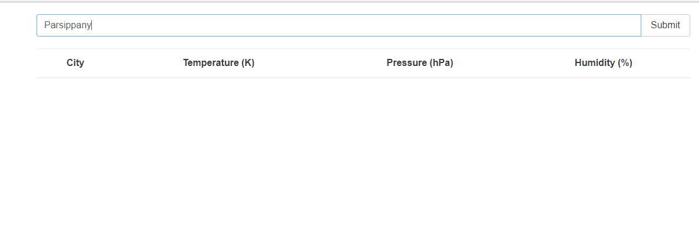
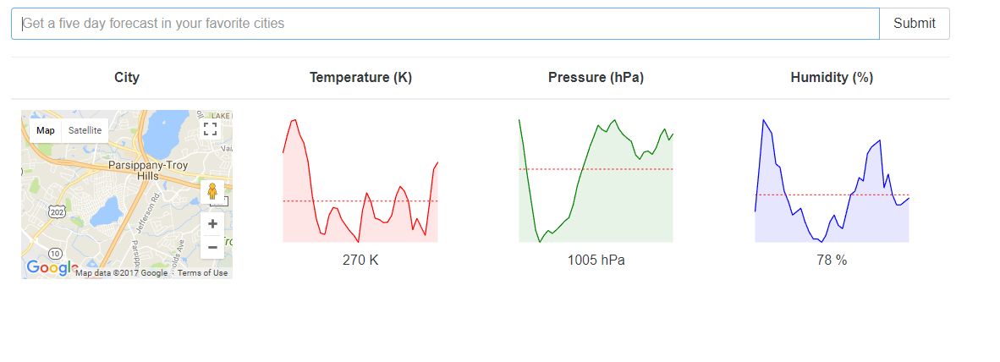
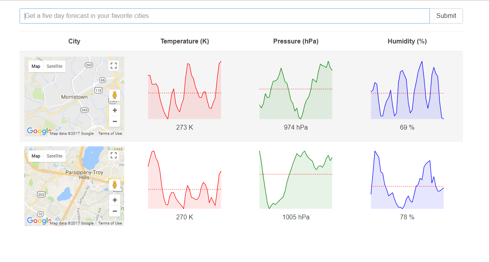
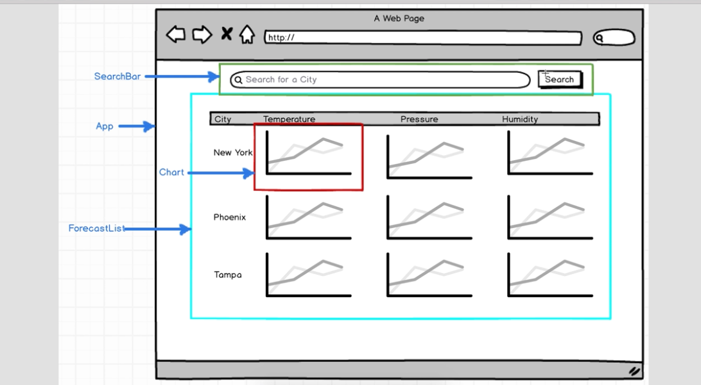

# Weather-React

### This is a Code-Along To Stephen Grider's [Modern React With Redux](https://www.udemy.com/react-redux/learn/v4/overview). This is the second major project code along.

#### A user can search for a city to display the 5 day weather forecast. Information on Temperature, Pressure and Humidity become available on charts. The searched cities location on google maps will also appear in the 'City' section. 

### Changes I made:
* None. Purpose was to get experience using redux, understanding actions, action creators, and reducers in a react application

Homepage

User types in a a city in the search bar. Then clicks submit button or enter.




Search Results 





### Technologies:
* React
* Redux
* Open Weather Map API
* Google Maps API
* React Sparklines
* axios
* webpack

### Containers
* Search Bar
* Weather List

### Components
* Charts
* Map
* App (Holds charts and map components)


### Outline




#### Familiar with Git?
Checkout this repo, install dependencies, then start the gulp process with the following:

```
> git clone https://github.com/yabdabs/ReactReduxWeatherApp.git
> cd ReactReduxWeatherApp
> npm install
> npm start
```

